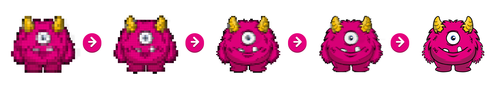

# Evo - Evolutionary NFT

Change your NFT proprieties by sending a token stream.

You can mint your own EVO at [exgrasia](https://github.com/nalinbhardwaj/exgrasia)

Each NFT has a paragon level (how many tokens you stream) that define the Evo state.

In this example Evo can max at paragon 5.

Classic Goopy Growth

